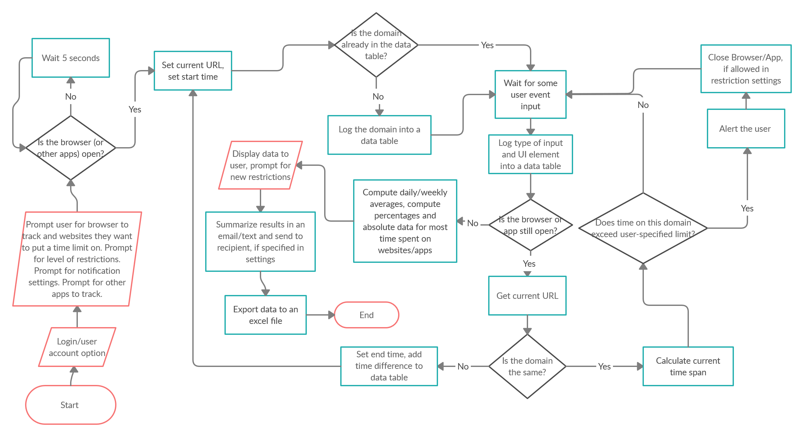
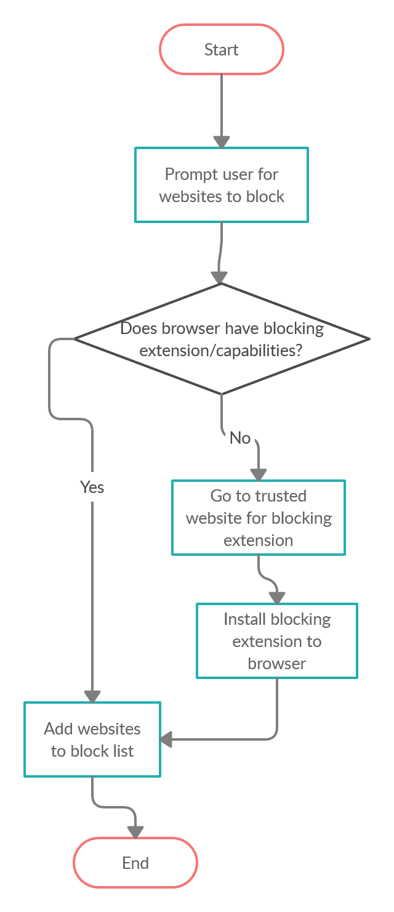

### Team 1 - Empty String 
#### P2 Proposal - Shantel Chi, Shalei Kumar, Andres Siles-Loayza

##### Overview
We want to create a robot that tracks the time spent on different applications that are running on our machine. Using Task Manager we will log what applications are running. If one of the applications is the browser, then we want to also track which specific websites the user is on. An application is considered active if we detect user input on the specifc application. We will log all the information on an Excel File where we will also calculate daily/weekly averages for each application and send the report to the user in an email.

User can also input applications/websites they want to put a time limit on and our robot will alert the user when they exceed that limit.

##### Why is this important?
This robot can be used as a time management tool to help users limit time they spend on the computers. 

##### Process

##### Supplementary Process: Adding to Browser Blocklist

